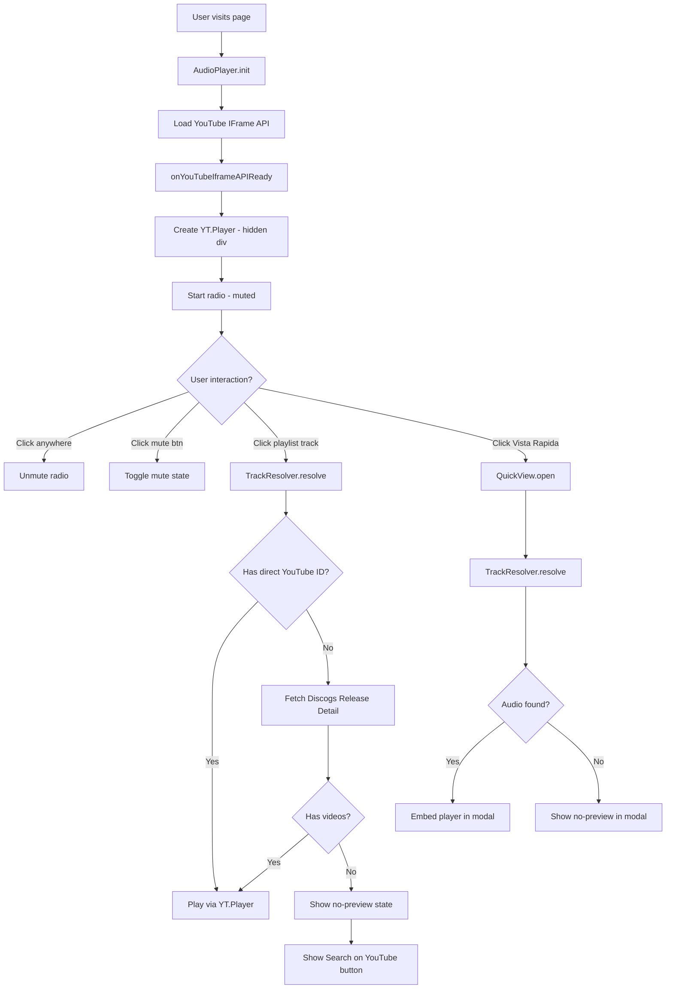
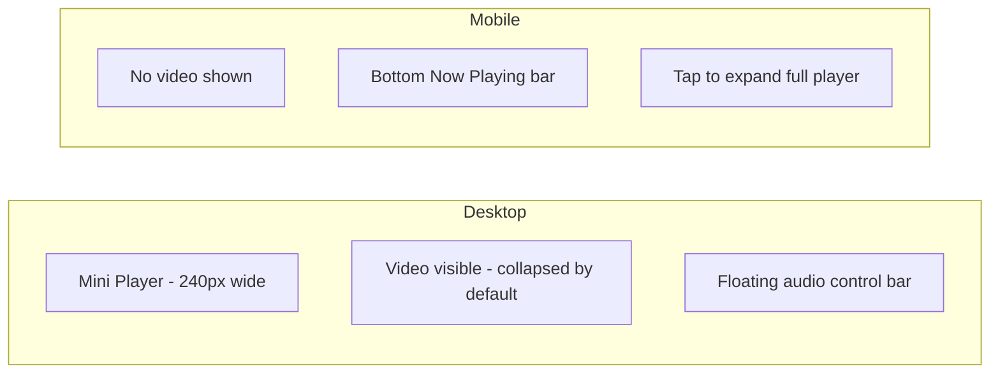

# Music Player Improvements Plan
## 3TRES6 Records — Exhaustive Brainstorm & Implementation Plan

---

## 1. Root Cause Analysis

### 1.1 Mute Bug — Video Starts Playing on Mute Click

**What happens:** When the user clicks the floating mute button (`#audioToggle`), instead of silencing the audio, the YouTube mini-player video starts playing visibly.

**Why it happens:**
- [`AudioPlayer.init()`](../script.js:915) starts music immediately with `startMuted = true` (muted iframe)
- A `unmuteHandler` is attached to the first `click` event on the document
- When the user clicks the mute button, **two things fire simultaneously**:
  1. The `audioToggle` click handler calls `this.mute()` (or `this.unmute()`)
  2. The `unmuteHandler` (once listener) fires and calls `this.unmute()`
- The `postMessage` mute/unmute commands are unreliable because the YouTube IFrame API requires the iframe to be fully initialized and the `enablejsapi=1` parameter alone is not enough — the `YT.Player` object must be created via the YouTube IFrame API JavaScript library
- Result: The video appears to "start playing" because the mute state is inconsistent

**Additional problem:** The `postMessage` approach (`{"event":"command","func":"mute","args":""}`) only works with the YouTube IFrame API when the player is initialized via `new YT.Player(...)`. A plain `<iframe>` with `enablejsapi=1` does NOT reliably respond to postMessage commands in all browsers.

### 1.2 Playlist/Song Playback Not Working

**What happens:** Clicking a track in the hero playlist either does nothing or shows an error.

**Why it happens:**
- [`HeroPlaylist.playWithYouTubeSearch()`](../script.js:1294) uses the URL format:
  `https://www.youtube.com/embed?listType=search&list=QUERY`
  **This feature was deprecated and removed by YouTube in 2023.** It no longer works.
- When a Discogs listing has no `release.videos` (most inventory items don't), `track.audioUrl` is empty, so `playWithYouTubeSearch()` is called — which fails silently
- The fallback products in [`loadFallbackProducts()`](../script.js:294) have hardcoded YouTube URLs, but the playlist data mapping wraps them in `release.videos[0].uri` format, which works — but only for fallback data
- For real Discogs inventory, `release.videos` is rarely populated in the inventory API response (it requires a separate release detail API call)

### 1.3 Quick Preview Not Ready

**What happens:** Clicking "Vista Rápida" on a catalog card opens a modal but the audio preview section may be empty or broken.

**Why it happens:**
- The `quickViewModal` HTML exists in `index.html` but the `#audioEmbed` element and `#quickViewModal` need verification
- The `data-audio` attribute on quick-view buttons is populated from `listing.audio_url || release.videos?.[0]?.uri || ''` — which is almost always empty for Discogs inventory API responses
- [`QuickView.renderAudioPreview()`](../script.js:830) handles the empty case with a "no preview" message, but there's no fallback search mechanism
- The modal itself may not have proper styling for the audio embed section

### 1.4 Mobile Experience — Video Thumbnail Annoyance

**What happens:** On mobile, a 200×113px YouTube video player appears fixed in the bottom-right corner, showing a video when the intent is background music.

**Why it happens:**
- The [`youtube-mini-player`](../styles.css:2578) is always visible when music is playing
- On mobile, this video thumbnail is distracting and takes up screen space
- The video content (a DJ set or music video) is not the focus — the audio is
- There's no option to collapse/minimize the video on mobile

---

## 2. Brainstorming: Music Player Architecture Options

### Option A: Pure YouTube IFrame API (Recommended)
Use the official YouTube IFrame Player API (`https://www.youtube.com/iframe_api`) to create a proper `YT.Player` object. This gives full programmatic control: play, pause, mute, unmute, volume, seek, and event callbacks.

**Pros:**
- Reliable mute/unmute via `player.mute()` / `player.unMute()`
- `onStateChange` events for detecting when a video ends (auto-advance playlist)
- `onError` events for detecting unavailable videos (handle gracefully)
- Works consistently across all browsers

**Cons:**
- Requires loading the YouTube IFrame API script
- The player must be in a visible `<div>` (can be hidden with CSS but not `display:none`)
- Still shows a video thumbnail unless hidden behind a cover image

### Option B: Audio-Only Mode via CSS Overlay
Keep the YouTube iframe but hide the video with a CSS overlay (album art on top), showing only the audio controls. The iframe plays in the background but is visually covered.

**Pros:**
- Simple implementation
- No API dependency
- Works on mobile

**Cons:**
- YouTube's Terms of Service technically require the player to be visible
- The video still loads (bandwidth waste on mobile)
- Mute/unmute still requires the IFrame API

### Option C: SoundCloud as Primary Audio Source
Use SoundCloud's free API to search for tracks and embed the SoundCloud player (audio-only by default).

**Pros:**
- Audio-only by default (no video)
- Free API with search capability
- Better mobile experience

**Cons:**
- Not all vinyl records are on SoundCloud
- Requires SoundCloud API key
- Different UX from YouTube

### Option D: Hybrid Approach (Recommended Final Solution)
1. Use YouTube IFrame API for the background radio (single video, always playing)
2. For individual track previews: try YouTube first, fall back to SoundCloud search, fall back to "no preview" message
3. Hide the video with a vinyl record cover art overlay on mobile
4. On desktop: show a minimal collapsed player (just waveform/title, no video)

---

## 3. Detailed Implementation Plan

### Fix 1: Mute/Unmute Bug

**Solution:** Replace the `postMessage` approach with the official YouTube IFrame API.

**Steps:**
1. Load the YouTube IFrame API script: `<script src="https://www.youtube.com/iframe_api"></script>`
2. Create a global `onYouTubeIframeAPIReady()` callback
3. Initialize `YT.Player` with the container div (not an existing iframe)
4. Replace `AudioPlayer.mute()` and `AudioPlayer.unmute()` with `ytPlayer.mute()` / `ytPlayer.unMute()`
5. Fix the `unmuteHandler` conflict: remove the auto-unmute on first click, instead show a "Click to play" overlay that the user must explicitly dismiss

**Key change in `AudioPlayer.init()`:**
```javascript
// BEFORE (broken):
this.startMusic(CONFIG.youtubeVideoId, '3TRES6 Radio', true);
document.addEventListener('click', unmuteHandler, { once: true });

// AFTER (fixed):
// Show "Click to play" overlay
// On click: initialize YT.Player, start playing unmuted
```

### Fix 2: Playlist/Song Playback

**Solution:** Multi-tier fallback system for track audio.

**Tier 1 — Direct YouTube ID from Discogs videos:**
- Already implemented, works when `release.videos` is populated

**Tier 2 — YouTube Search via Data API (requires API key):**
- Use YouTube Data API v3 search: `GET https://www.googleapis.com/youtube/v3/search?q=ARTIST+TITLE&type=video&key=API_KEY`
- Returns actual video IDs that can be played
- Requires a free YouTube Data API key (10,000 units/day free)

**Tier 3 — Discogs Release Detail API:**
- When inventory listing has no videos, fetch the full release: `GET /releases/{release_id}`
- This endpoint includes `videos` array with YouTube URLs
- Cache results to avoid rate limiting

**Tier 4 — "No Preview" graceful state:**
- Show album art with a "No preview available" message
- Offer a "Search on YouTube" button that opens YouTube in a new tab
- Never show a broken player

**Playlist state machine:**
```
IDLE → LOADING → PLAYING → PAUSED → NEXT/PREV → LOADING
                         ↓
                    ERROR (no video) → SKIP_TO_NEXT or SHOW_NO_PREVIEW
```

### Fix 3: Quick Preview Feature

**Solution:** Redesign the Quick Preview modal audio section.

**Current state:** The modal exists but audio is often empty.

**New design:**
1. When opening Quick Preview, immediately show album art + track info
2. Show a "Preview" section with three states:
   - **Loading:** Spinner while searching for audio
   - **Available:** Embedded player (YouTube or SoundCloud)
   - **Unavailable:** "No preview available" + "Search on YouTube" button
3. For the audio search, use the same Tier 1-4 fallback system as the playlist
4. Add a "30-second preview" concept: start the YouTube video at a specific timestamp (e.g., `?start=30`) to give a taste without playing from the beginning

**Quick Preview modal improvements:**
- Add vinyl record spinning animation while audio loads
- Show track waveform visualization (CSS animation)
- Add "Add to Playlist" button to add the track to the hero playlist
- Show related tracks from the same label/genre

### Fix 4: Mobile Experience

**Solution:** Audio-only mode on mobile with collapsible player.

**Mobile player design:**
- Hide the YouTube video iframe on mobile (use `pointer-events: none; opacity: 0; height: 0`)
- Show only the floating audio control bar (already exists as `#audioControls`)
- Add a "Now Playing" mini-bar at the bottom of the screen on mobile (like Spotify's mobile player)
- The mini-bar shows: album art thumbnail + track title + play/pause button
- Tapping the mini-bar expands to a full-screen player overlay

**Desktop player design:**
- Keep the mini YouTube player but make it collapsible
- Add a "collapse" button that hides the video and shows only the title bar
- Remember the collapsed state in localStorage

**CSS approach for hiding video on mobile:**
```css
@media (max-width: 768px) {
    .youtube-mini-player iframe {
        height: 0 !important;
        overflow: hidden;
    }
    .youtube-mini-player {
        width: auto;
        /* Show only the info bar */
    }
}
```

---

## 4. New Music Player Architecture

### Component Structure

```
MusicPlayer (orchestrator)
├── RadioPlayer (background YouTube audio)
│   ├── YT.Player instance (hidden on mobile)
│   ├── MuteControl (floating button)
│   └── NowPlayingBar (floating info)
├── PlaylistPlayer (hero section)
│   ├── TrackList (from Discogs inventory)
│   ├── TrackResolver (Tier 1-4 audio lookup)
│   └── PlaylistControls (prev/next/play/pause)
└── QuickPreview (modal)
    ├── AudioPreview (embedded player)
    ├── TrackResolver (same as above)
    └── AddToCart / AddToPlaylist
```

### TrackResolver Service

```javascript
const TrackResolver = {
    async resolve(track) {
        // Tier 1: Direct YouTube ID from Discogs
        if (track.audioUrl) {
            const videoId = this.extractYouTubeId(track.audioUrl);
            if (videoId) return { type: 'youtube', id: videoId };
        }
        
        // Tier 2: Discogs Release Detail API
        if (track.releaseId) {
            const videos = await this.fetchDiscogsVideos(track.releaseId);
            if (videos.length > 0) {
                const videoId = this.extractYouTubeId(videos[0].uri);
                if (videoId) return { type: 'youtube', id: videoId };
            }
        }
        
        // Tier 3: YouTube Data API search (if API key available)
        if (CONFIG.youtubeApiKey) {
            const videoId = await this.searchYouTube(track.artist, track.title);
            if (videoId) return { type: 'youtube', id: videoId };
        }
        
        // Tier 4: No preview available
        return { type: 'none', searchQuery: `${track.artist} ${track.title}` };
    }
};
```

### State Machine for Audio Player

```
States: IDLE | LOADING | PLAYING | PAUSED | MUTED | ERROR

Transitions:
IDLE → LOADING (user clicks play)
LOADING → PLAYING (video loaded)
LOADING → ERROR (video unavailable / API error)
PLAYING → PAUSED (user clicks pause)
PLAYING → MUTED (user clicks mute)
PLAYING → LOADING (track change)
MUTED → PLAYING (user clicks unmute)
PAUSED → PLAYING (user clicks play)
ERROR → LOADING (retry or skip)
ERROR → IDLE (user dismisses)
```

---

## 5. Feasibility Assessment

### YouTube Playlist Challenge

**Problem:** Not all vinyl records have YouTube videos. Discogs inventory API rarely includes `release.videos`. The YouTube search embed (`listType=search`) is deprecated.

**Feasibility of solutions:**

| Approach | Feasibility | Notes |
|----------|-------------|-------|
| Direct YouTube ID from Discogs | Medium | Only works if seller has added videos to releases |
| Discogs Release Detail API | High | Extra API call per track, but reliable |
| YouTube Data API search | High | Free tier: 10,000 units/day, search costs 100 units |
| YouTube search embed (deprecated) | None | Removed by YouTube in 2023 |
| SoundCloud API | Medium | Requires API key, not all tracks available |
| Manual YouTube URL mapping | High | Admin adds YouTube URLs per vinyl in a config file |

**Recommended approach:** Use Discogs Release Detail API as Tier 2 (lazy-loaded when user clicks a track), with a manual YouTube URL mapping as an override system.

### Catalog Vinyl Without Content

**Problem:** Some vinyl records in the catalog may have no audio preview anywhere.

**Solution:** 
- Show a "No preview available" state gracefully (not an error)
- Offer "Search on YouTube" button (opens YouTube search in new tab)
- Offer "Listen on Discogs" button (links to the Discogs release page)
- Never block the purchase flow — the user can still add to cart

### Rate Limiting Concerns

- Discogs API: 60 requests/minute (authenticated), 25/minute (unauthenticated)
- YouTube Data API: 10,000 units/day free
- Solution: Aggressive caching (localStorage + sessionStorage), lazy loading (only fetch when user interacts)

---

## 6. Implementation Steps (Ordered)

### Phase 1: Critical Fixes (High Priority)

1. **Fix mute bug** — Replace postMessage with YouTube IFrame API
   - Load `https://www.youtube.com/iframe_api`
   - Implement `onYouTubeIframeAPIReady()` callback
   - Create `YT.Player` instance in a hidden div
   - Replace `mute()`/`unmute()` methods
   - Fix the auto-unmute conflict with the toggle button

2. **Fix playlist playback** — Remove deprecated YouTube search embed
   - Remove `playWithYouTubeSearch()` method
   - Implement `TrackResolver` with Discogs Release Detail API fallback
   - Add graceful "no preview" state with YouTube search link
   - Cache resolved track URLs in sessionStorage

3. **Fix mobile video** — Hide video on mobile, show audio-only UI
   - Add CSS to hide iframe height on mobile
   - Create a mobile-friendly "Now Playing" bottom bar
   - Add collapse/expand functionality to mini-player

### Phase 2: Quick Preview Enhancement (Medium Priority)

4. **Quick Preview audio** — Implement proper audio preview in modal
   - Use `TrackResolver` to find audio for the selected vinyl
   - Show loading state while resolving
   - Display YouTube embed or "no preview" message
   - Add "Search on YouTube" fallback button

5. **Quick Preview UX** — Improve the modal experience
   - Add vinyl spinning animation
   - Show track details from Discogs
   - Add "Add to Playlist" button

### Phase 3: Player Experience (Enhancement)

6. **Persistent player state** — Remember what was playing
   - Save current track to localStorage
   - Resume on page reload (with user permission)

7. **Player UI redesign** — More polished music player
   - Progress bar (if using YouTube IFrame API)
   - Volume control that actually works
   - Track duration display

8. **Playlist management** — Better playlist UX
   - Shuffle mode
   - Repeat mode
   - "Add to queue" from catalog cards

---

## 7. Files to Modify

| File | Changes |
|------|---------|
| [`script.js`](../script.js) | Major refactor of `AudioPlayer`, `HeroPlaylist`, `QuickView`; add `TrackResolver` |
| [`styles.css`](../styles.css) | Mobile player styles, collapse animation, "Now Playing" bar |
| [`index.html`](../index.html) | Add YouTube IFrame API script tag, update mini-player HTML structure |

---

## 8. Mermaid Architecture Diagram




